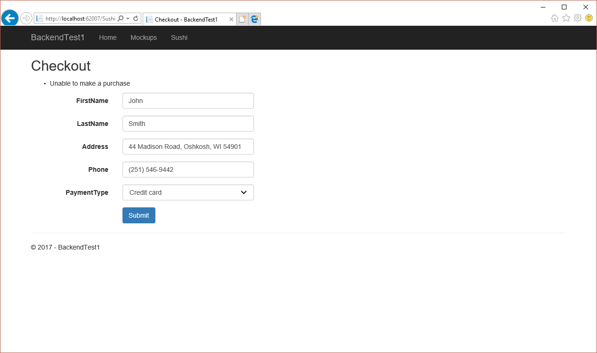

# Контрольная 1, вариант 2

## Задача

Необходимо реализовать веб-приложение, представляющее упрощенный сайт заказа суши, по описанию, предоставленному ниже.

1. Сайт должен отображать каталог доступных для заказа роллов с их названием и доступным количеством (рис. 1). Если ролла нет в наличие - он не должен отображаться в списке.
2. Пользователь может нажать на кнопку `Add` напротив ролла, который он хочет заказать, добавив ролл в корзину (корзина должна храниться в полях формы; для упрощения пользователь может заказать один ролл каждого вида).
3. Если в корзине есть хотя бы один ролл - под таблицей необходимо отобразить список роллов в ней и кнопку `Proceed to checkout` (рис. 2)
4. Напротив роллов, добавленных пользователем в корзину кнопку `Add` необходимо заменить на кнопку `Remove`, которая позволит пользователю удалить ролл из корзины.
5. При нажатии на `Proceed to checkout` пользователь попадает на страницу, где ему необходимо оставить свою контактную информацию (рис. 3), выбрать метод оплаты и подтвердить желание сделать заказ, нажав на кнопку `Submit`.
6. После нажатия на кнопку `Submit` выполняется проверка, есть ли заказанные роллы в наличие, если есть - их остатки уменьшаются и пользователь попадает на страницу, где отображается итог (рис. 4).
7. Если заказанные роллы отсутствуют в наличие (были заказаны другим пользователем, в промежуток времени между переходом на страницу ввода контактной информации и нажатием на кнопку `Submit`) - то при нажатии на кнопку `Submit` пользователь получит ошибку указывающую на то, что выбранные роллы на данным момент отсутствуют в наличие.
8. Изначально, в каталоге должны быть доступны роллы следующих типов: Alaska roll, California roll, Norway roll, Philadelphia roll, Seattle roll в количестве 2 шт. каждый.

## Результат

*Рис 1. Каталог доступных для заказа роллов*

*Рис 2. Выбранные роллы отображаются под каталогом вместе с кнопкой `Proceed to checkout`*

*Рис 3. Страница для ввода контактной информации*

*Рис 4. Страница с результатом заказа*

*Рис 5. Ошибка, появляющася при отсутствии роллов в наличие*

## Технические детали

Необходимо реализовать:

1. Службу `SushiCatalogService`, позволяющую вести учет имеющихся в наличие роллов (получать остатки и уменьшать остатки при совершении заказа).
2. Контроллер `SushiController` с 2 экшенами (3 методами).
3. 3 представления на основе предоставленных макетов с 2-мя разными моделями представления.